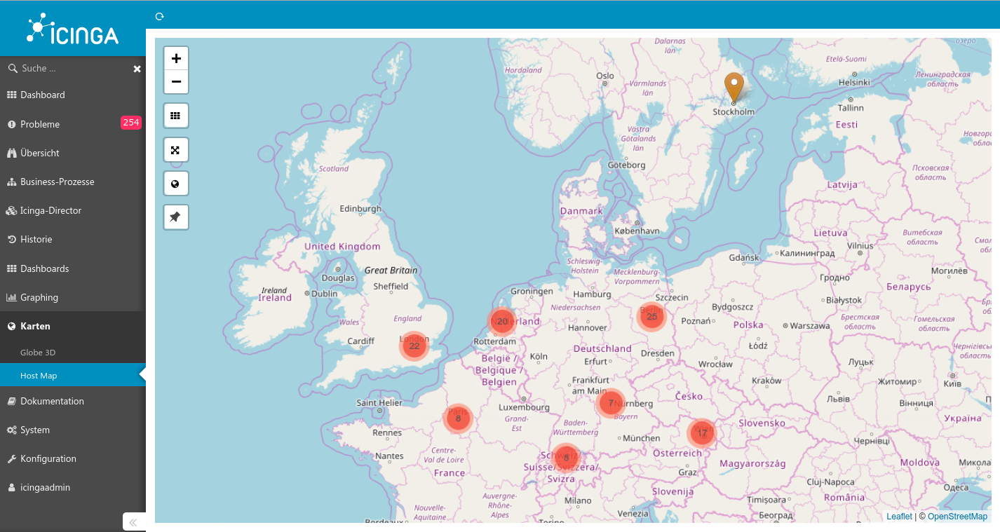
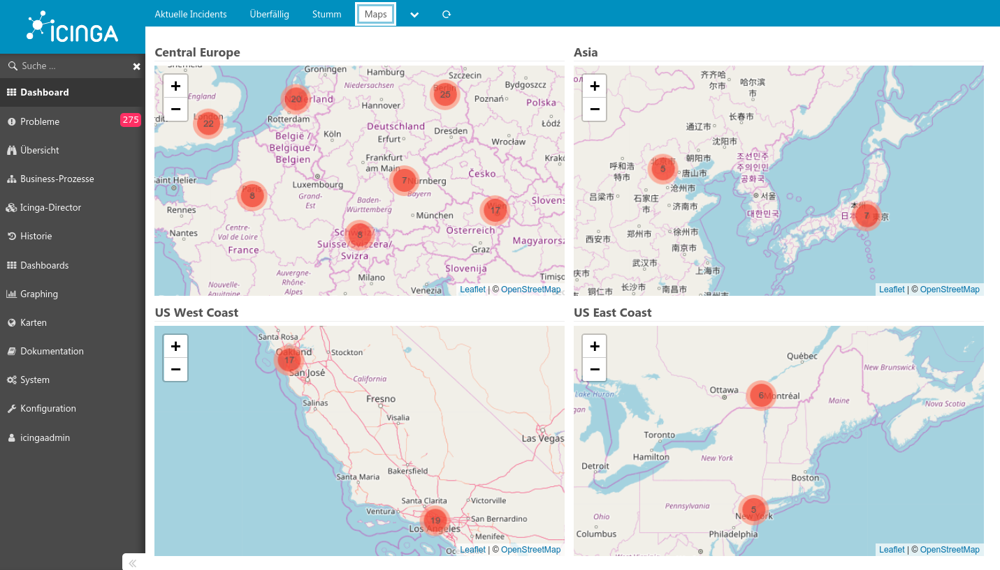

# Map module for Icinga Web 2

#### Table of Contents

1. [About](#about)
2. [License](#license)
3. [Documentation](#documentation)
4. [Support](#support)
5. [Requirements](#requirements)
6. [Thanks](#thanks)
7. [Contributing](#contributing)

## About

This module displays host objects as markers on [openstreetmap](https://www.openstreetmap.org) using [leaflet.js](http://leafletjs.com/). If you configure multiple hosts with the same coordinates, i.e. servers in a datacenter, a clustered view is rendered.

You could also integrate a map as dashlet into your dashboards:

## License

Icinga Web 2 and this Icinga Web 2 module are licensed under the terms of the GNU General Public License Version 2, you will find a copy of this license in the LICENSE file included in the source package.

This module uses Leaflet and several plugins:

* [Leaflet](https://github.com/Leaflet/Leaflet) - BSD 2-clause "Simplified" License
* [Leaflet.markercluster](https://github.com/Leaflet/Leaflet.markercluster) - MIT license
* [Leaflet.Locate](https://github.com/domoritz/leaflet-locatecontrol) - MIT license
* [Leaflet.EasyButton](https://github.com/CliffCloud/Leaflet.EasyButton) - MIT license
* [Leaflet.Spin](https://github.com/makinacorpus/Leaflet.Spin) - MIT license
* [Leaflet.awesome-markers](https://github.com/lvoogdt/Leaflet.awesome-markers) - MIT license
* [Spin.js](spin.js.org) - MIT license

## Documentation

* [Installation](doc/01-Installation.md)
* [Adding markers to your map](doc/02-Add-Items-to-map.md)
* [Exploring the map](doc/03-Exploring-the-map.md)

## Support

Join the [Icinga community channels](https://www.icinga.com/community/get-involved/) for questions.

## Requirements

* [Icinga Web 2](https://www.icinga.com/products/icinga-web-2/) (>= 2.4.1)

## Thanks

This module borrows a lot from https://github.com/Mikesch-mp/icingaweb2-module-globe.

## Contributing

There are many ways to contribute to the Icinga Web module for Maps --
whether it be sending patches, testing, reporting bugs, or reviewing and
updating the documentation. Every contribution is appreciated!

Please continue reading in the [contributing chapter](CONTRIBUTING.md).
