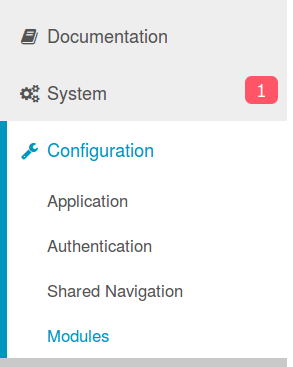

<a id="Installation"></a>Installation
=====================================

Requirements
------------

* Icinga Web 2 (&gt;= 2.4.1)
* PHP (&gt;= 5.3 or 7.x)

The Icinga Web 2 `monitoring` module needs to be configured and enabled.

Installation from .tar.gz
-------------------------

Download the latest version and extract it to a folder named `map`
in one of your Icinga Web 2 module path directories.

You might want to use a script as follows for this task:
```sh
ICINGAWEB_MODULEPATH="/usr/share/icingaweb2/modules"
REPO_URL="https://github.com/nbuchwitz/icingaweb2-module-map"
TARGET_DIR="${ICINGAWEB_MODULEPATH}/map"
MODULE_VERSION="1.0.4"
URL="${REPO_URL}/archive/v${MODULE_VERSION}.tar.gz"
install -d -m 0755 "${TARGET_DIR}"
wget -q -O - "$URL" | tar xfz - -C "${TARGET_DIR}" --strip-components 1
```

Installation from GIT repository
--------------------------------

Another convenient method is the installation directly from our GIT repository.
Just clone the repository to one of your Icinga Web 2 module path directories.
It will be immediately ready for use:

```sh
ICINGAWEB_MODULEPATH="/usr/share/icingaweb2/modules"
REPO_URL="https://github.com/nbuchwitz/icingaweb2-module-map"
TARGET_DIR="${ICINGAWEB_MODULEPATH}/map"
git clone "${REPO_URL}" "${TARGET_DIR}"
```

You can now directly use our current GIT master or check out a specific version.

Enable the newly installed module
---------------------------------

Enable the `map` module either on the CLI by running

```sh
icingacli module enable map
```

Or go to your Icinga Web 2 frontend, choose `Configuration` -&gt; `Modules`...



...choose the `map` module and `enable` it:


It might afterwards be necessary to refresh your web browser to be sure that
newly provided styling is loaded.

Getting started with the map
---------------------------------------------

That's it, *Map* is now ready for use. Please read more on [adding markers to your map](02-Add-Items-to-map.md).
