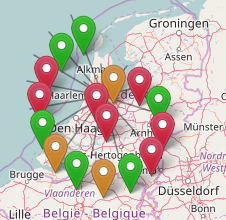
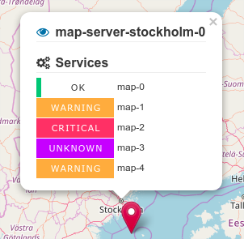
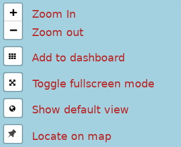

# Getting Started

Once you enable the *Host Map* module, it will pop up in your menu in the ``Maps`` section.
When you click on it, it will show you a map:

## Exploring the map

### Basic usage

Every host is represented by a colored marker, which indicates the overall host state.

Markers are grouped into clusters, depending on their location and the zoom level. Every cluster marker has a label with the number of clustered markers.

By clicking on the icon, the cluster expands and the underlying host markers will be visible:

To show more details about a host click on the host marker. If you want to show the host in the detail view of the `monitoring module` just click on the eye icon.

### Control elements

In the upper left corner of the map there are six control elements:
 

## Filtering host objects

The normal icingaweb2 filter syntax can be used to filter the amount of hosts being displayed. Filters have to be appended to the url (eg. `?host=web*`)

**Filter examples:**

| Filter expression | Description |
| ----------------------------------------------------- | ------------ |
| hostgroup_name=customer1&_host_environment=production | Show all hosts of hostgroup `customer1` of environment `production` |
| _host_customer=(max-corp\|icinga)                     | Show all hosts with `max-corp` or `icinga` in customvar `customer` |

## Dashboard integration

To add a map widget to a dashboard (or a new one) click on the `Add to dashboard` button as shown above.
