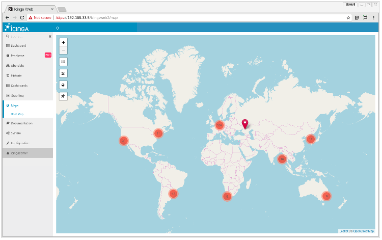

# Exploring the map

Once you enable the *Host Map* module, it will pop up in your menu in the ``Maps`` section.
When you click on it, it will show you a map:



## Basic usage

Every host is represented by a colored marker, which indicates the overall host state.

Markers are grouped into clusters, depending on their location and the zoom level. Every cluster marker has a label with the number of clustered markers.


By clicking on the icon, the cluster expands and the underlying host markers will be visible:


To show more details about a host click on the host marker. If you want to show the host in the detail view of the `monitoring module` just click on the eye icon.


### Control elements

In the upper left corner of the map there are six control elements:
 


## Filtering host objects

The usual icingaweb2 filter syntax can be used to filter the set of hosts being displayed. Filters have to be appended to the url (eg. `?host=web*`)

**Filter examples:**

| Filter expression | Description |
| ----------------------------------------------------- | ------------ |
| hostgroup_name=customer1&_host_environment=production | Show all hosts of hostgroup `customer1` of where the custom variable environment is equal to `production` |
| _host_customer=(max-corp\|icinga)                     | Show all hosts where the custom variable `customer` is set to `max-corp` or `icinga` |
| host_in_downtime=0&host_acknowledged=0 | Don't show acknowledged or objects in downtime |
|problems&host_state=1 | Show all hosts in state DOWN `1` (`0` = UP, `1`= DOWN) |


## Dashboard integration

To add a map widget to a dashboard (or a new one) click on the `Add to dashboard` button as shown above. Any filters which are applied to the current view, are also stored in the dashlet.


## Settings

Besides the global map configuration in the module settings, it is possible to override these settings per user or per each map.

The following parameters could be overriden:

| Parameter | 
| --- |
| min_zoom |
| max_zoom |
| max_native_zoom |
| disable_cluster_at_zoom |
| default_zoom |
| default_long |
| default_lat |
| stateType |
| cluster_problem_count |
| tile_url |

Hierarchy: ``Module Config < User Config < Map Config``

### Map specific overrides

All config parameters above could be changed for the specific map by adding it to the URL. Use the ampersand sign for concatenation of multiple parameters.

Example: ``/icingaweb2/map?default_zoom=20&default_long=13.370324&default_lat=52.500859``

### User specific overrides

The way in which a user-specific configuration can be stored depends on how Icinga Web 2 manages its configuration.

#### File

Add a new section named ``map`` to your users Icinga Web 2 configuration (``/etc/icingaweb2/preferences/<USERNAME>/config.ini``) and put in the parameters you would like to override.

#### Database

You need to manually insert an entry in the users database configuration for each parameter you'd like to change:

```sql
insert into icingaweb_user_preference values ("USER", "map", "default_zoom", 5, "2018-08-23 08:52:19", "2018-08-23 08:52:19");
insert into icingaweb_user_preference values ("USER", "map", "default_lat", "29.87", "2018-08-23 08:52:19", "2018-08-23 08:52:19");
insert into icingaweb_user_preference values ("USER", "map", "default_long", "-88.90", "2018-08-23 08:52:19", "2018-08-23 08:52:19");
```

### Disable clustering
In some environments it is desired not to cluster the markers.
The cluster function can be deactivated with the configuration option ``disable_cluster_at_zoom``, either at a certain zoom level (e.g. ``disable_cluster_at_zoom=10`` or completely (``disable_cluster_at_zoom=1``)

### Show number of problems instead of totals

Set ``cluster_problem_count`` to ``1`` to show the number of problems in the cluster instead of the marker count.
